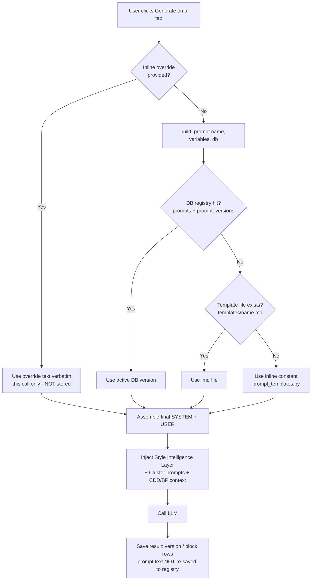

# CAS Prompt Injection — How Prompts Flow Through Content AI Studio

_A plain-language walkthrough of **which prompts are injected at every step**, **where they come
from**, **whether they are read from / stored in the database**, and **what happens when a user
edits a prompt in a tab.**_

> Pipeline covered: **Project → Cluster → Course → Style → CDD → Blueprint → Generate**

---

## 1. The one idea you must understand first

Not every step calls the AI. Some steps are just **containers** (they organize work), and only some
steps actually **send a prompt to the LLM**.

| Step | Sends a prompt to the AI? | What it really is |
|------|:--:|-------------------|
| **Project** | ❌ No | A folder that owns everything below it |
| **Cluster** | ❌ No (but it *stores* reusable prompt snippets) | A group of related courses; holds "Cluster Prompts" that get injected downstream |
| **Course** | ❌ No | A folder that points to the active Style / CDD / Blueprint |
| **Style** | ✅ Yes | Reads your reference docs → produces a "Style Intelligence Layer" |
| **CDD** | ✅ Yes | Writes the Course Design Document |
| **Blueprint** | ✅ Yes | Writes the module-by-module blueprint |
| **Generate** | ✅ Yes | Writes the actual lesson / assessment content |

So there are only **four AI steps**: Style, CDD, Blueprint, Generate. Everything about "prompt
injection" is really about these four.

---

## 2. Every prompt is a pair: SYSTEM + USER

Whenever CAS calls the AI, it sends **two texts**:

- **System prompt** → the *role and rules* ("You are an expert Instructional Designer… follow these
  rules…"). It is the reusable, template-like part.
- **User prompt** → the *actual request with the real data filled in* ("Create a CDD for **Clinical
  Nursing**, audience **Year-2 nursing students**, duration **8 hours**…").

The system prompt is what lives in the prompt library/registry. The user prompt is mostly **built on
the fly in code** from the data you typed on that page.

---

## 3. The 3-tier fallback — where a prompt is fetched from

For the steps that use the prompt registry (Style, CDD, Blueprint), CAS looks for the prompt in
**three places, in this exact order**. The first one that exists wins:

```
┌─────────────────────────────────────────────────────────────────────┐
│  build_prompt(name, variables, db=db)   →   load_template(...)       │
└─────────────────────────────────────────────────────────────────────┘
        │
        ▼
   ① DATABASE            prompts + prompt_versions tables
      (highest)          Admin-editable at runtime via the Prompts page.
        │                Looks up Prompt.name, takes the is_active version.
        │  (miss)
        ▼
   ② FILE                promptops_app/prompts/templates/<name>.md
      (middle)           Ships with the code. Split into SYSTEM / USER by
        │                the "--- USER ---" marker.
        │  (miss)
        ▼
   ③ INLINE CONSTANT     Hard-coded Python string in
      (last resort)      promptops_app/prompt_templates.py
                         e.g. CDD_SYSTEM_PROMPT, BLUEPRINT_SYSTEM_PROMPT.
                         Used inside the `except:` safety net so generation
                         never crashes even if the DB path fails.
```

**Code that implements this:** `promptops_app/prompts/prompt_loader.py` (`load_template` →
`_from_db` → `_from_file`) and `promptops_app/prompts/prompt_builder.py` (`build_prompt`).

**Plain meaning:** if an admin has edited the prompt in the database, that DB copy is used. If not,
the shipped `.md` file is used. If even that is missing, the hard-coded Python string is used. You
can never end up with "no prompt."

---

## 4. Step-by-step: what is injected at each step

### 🗂️ Project — no prompt
A Project is a top-level container. It does not call the AI and injects no prompt. It only supplies
its `project_id`, which later steps attach to their AI calls for scoping and usage logging.

### 🗂️ Cluster — no direct prompt, but stores reusable snippets
A Cluster groups related courses. It does **not** run its own AI generation today. However, the
Cluster tab lets you create **Cluster Prompts** — reusable text snippets stored in the
`cluster_prompts` database table (model `ClusterPrompt` in `promptops_app/database.py`).

These snippets are **auto-injected downstream**: when Style / CDD / Blueprint build their context,
`build_style_context(db, style, cluster_id=...)` pulls every cluster prompt for that cluster and
prepends it to the style context:

```python
# promptops_app/database.py — build_style_context()
if cluster_id:
    for cp in get_cluster_prompts(db, cluster_id):
        content = cp.system_prompt or cp.user_prompt_template or ""
        parts.append(f"## Cluster Prompt: {cp.name}\n{content[:3000]}")
```

So a Cluster's contribution to prompting is **stored in the DB** and **injected as extra context**
into the courses beneath it — it never becomes its own system/user prompt pair.

### 🗂️ Course — no prompt
A Course is another container. It does not call the AI. Its job is to remember **which Style, which
CDD, and which Blueprint are "active"** (`active_cdd_id`, `active_blueprint_id`, and the active-style
pointer). Those active pieces are what later steps inject.

### 🎨 Style — first AI step
**Endpoint:** `POST /api/v1/styles/{id}/understand` → `promptops_app/services/style_service.py`

| | Source |
|---|---|
| **System prompt** | 3-tier fallback: DB `prompts` row named **`style_understanding`** → file `templates/style_understanding.md` → inline `_STYLE_UNDERSTANDING_SYSTEM` constant |
| **User prompt** | **Built in code** — your uploaded reference documents + custom instructions are stitched together (`_build_unified_style_docs`). Not from the registry. |
| **DB-backed?** | ✅ Yes — the system prompt is fetched from the DB first (via `load_template("style_understanding", db=db)`) |
| **Output stored?** | ✅ The generated text is saved to `Style.generated_summary`. This becomes the **"Style Intelligence Layer"** injected into CDD / Blueprint / Generate later. |

### 📘 CDD — second AI step
**Endpoint:** `POST /api/v1/cdd/generate` → `app/api/v1/routers/cdd.py`

| | Source |
|---|---|
| **System prompt** | 3-tier fallback via `build_prompt("cdd_generation", variables, db=db)`: DB `prompts` row **`cdd_generation`** → file `cdd_generation.md` → inline `CDD_SYSTEM_PROMPT` |
| **User prompt** | Same `build_prompt` call renders the **`cdd_generation` user template** with your data (`course_title`, `target_audience`, `expert_domain`, duration, etc.) filled in |
| **Style injected?** | ✅ The active Style's `generated_summary` (+ any cluster prompts) is fetched via `build_style_context` and prepended as an **"ACTIVE STYLE — Apply throughout"** block |
| **DB-backed?** | ✅ Yes — DB registry consulted first, file/inline only as fallback |
| **Output stored?** | ✅ Saved as a `CourseDesignDocument` + `CDDVersion` (the *content*). The *prompt text itself* is **not** written back into the registry. |

### 📐 Blueprint — third AI step
**Endpoint:** `POST /api/v1/blueprints/generate` → `app/api/v1/routers/blueprints.py`

| | Source |
|---|---|
| **System prompt** | 3-tier fallback via `build_prompt("blueprint_generation", variables, db=db)`: DB `prompts` row **`blueprint_generation`** → file `blueprint_generation.md` → inline `BLUEPRINT_SYSTEM_PROMPT` / `TEACHER_BLUEPRINT_SYSTEM_PROMPT` |
| **User prompt** | Rendered from the `blueprint_generation` template with the **active CDD's summary** as context (`cdd_context`), plus the selected module |
| **Teacher vs Student** | Chosen by a `teacher_mode` / `student_mode` variable flag passed into the template (one registry row handles both today) |
| **Style injected?** | ✅ Active Style + cluster prompts prepended as an **"ACTIVE STYLE"** block |
| **DB-backed?** | ✅ Yes — DB registry first |
| **Output stored?** | ✅ Saved as `ModuleBlueprint` + `BlueprintVersion` (content only; prompt not written to the registry) |

### ✍️ Generate — fourth AI step (the odd one out)
**Endpoint:** `POST /api/v1/generations/launch` → runs async in a Celery worker →
`promptops_app/jobs/generation_jobs.py` (`run_generation_job`)

⚠️ **Generate does NOT use the prompt registry / 3-tier fallback.** It assembles the prompt
**directly from hard-coded Python constants** in `promptops_app/prompt_templates.py`:

```python
# promptops_app/jobs/generation_jobs.py (simplified)
User_prefix = PERSONA_PREFIX_TEMPLATE.format(expert_exp, expert_domain, aud_cat, target_audience)
# active style appended into User_prefix as "--- ACTIVE INSTRUCTIONAL STYLE ---"
system_p = User_prefix + LESSON_WITH_CONTEXT_SYSTEM + citation_instruction
user_p   = LESSON_WITH_CONTEXT_USER.format(lesson_topic=topic, context_injection=ctx_injection, ...) + context
```

| | Source |
|---|---|
| **System prompt** | Hard-coded `PERSONA_PREFIX_TEMPLATE` + `LESSON_WITH_CONTEXT_SYSTEM` (+ a citation rule). For non-lesson components, `build_component_generation_prompt()` in `blueprint_parser.py`. **No DB lookup.** |
| **User prompt** | Hard-coded `LESSON_WITH_CONTEXT_USER` filled with the topic + injected **CDD context + Blueprint context + source documents** |
| **Style injected?** | ✅ Active Style pulled with `build_style_context` and embedded as an **"ACTIVE INSTRUCTIONAL STYLE"** block |
| **DB-backed?** | ❌ **No** — even though `content_generation` / `quiz_generation` rows exist in the registry, the live Generate path ignores them and uses the constants |
| **Output stored?** | ✅ Saved as `Generation` + `Block` rows |

> This is a known gap, documented in `PROMPT_CONSOLIDATION_PLAN.md`: today **only CDD and Blueprint
> (and Style) read the DB registry; Generate is still hard-coded.**

---

## 5. The key question: "If I edit a prompt in a tab, is it just used once, or saved?"

There are **two completely different kinds of editing**, and this is the crux of your question:

### ✏️ A) Inline override on a generation tab → **used once, NOT saved**
On the CDD, Blueprint, and Style tabs the user can open the prompt panel and tweak the prompt before
clicking generate. That edited text is sent as `system_prompt_override` / `user_prompt_override`.

```python
# app/api/v1/routers/cdd.py
if request_body.system_prompt_override and request_body.user_prompt_override:
    system_prompt = request_body.system_prompt_override   # used verbatim
    user_prompt   = request_body.user_prompt_override
else:
    system_prompt, user_prompt, _, _ = build_prompt("cdd_generation", variables, db=db)
```

The schema even says so explicitly:
> _"replaces the default system prompt **for this generation only**."_ — `app/schemas/cdd.py`

**What this means for you:**
- The override is applied to **that single AI call only**.
- It is **NOT written** to the `prompts` / `prompt_versions` registry.
- It is **NOT** remembered for the next generation — reopen the tab and you're back to the default.
- The generated *result* is saved (as a CDD/Blueprint version), but the *edited prompt text* is not
  stored anywhere reusable. (The version's `generation_params` records metadata like course title
  and instructions — not the prompt body.)

### ✏️ B) Editing in the dedicated **Prompts** (registry/admin) page → **saved & versioned**
The Prompts admin page (`app/api/v1/routers/prompts.py`, Streamlit `pages/prompts.py`) is the **only
place** where a prompt edit becomes permanent. Saving there calls `deploy_new_version()`:

```python
# promptops_app/repositories/prompt_repository.py — deploy_new_version()
db.query(PromptVersion).filter(prompt_id == prompt.id).update({is_active: False})  # retire old
db.add(PromptVersion(prompt_id, version, system_prompt, user_prompt_template, is_active=True, ...))
```

**What this means for you:**
- A **new row** is appended to `prompt_versions` and marked active (old versions are kept, never
  overwritten — full history).
- From then on, the **DB tier** of the 3-tier fallback returns your edited version, so **every**
  future CDD / Blueprint / Style generation uses it automatically.
- This is a real, versioned, auditable change — the opposite of the one-shot inline override.

### Side note: "Prompt Fixing" (scope locking) exists in the DB but isn't wired to the API yet
The schema supports locking a specific prompt to a **course → cluster → project → global** scope
(`prompt_fixings` table, `resolve_fixed_prompt()`). Today that resolver is **only called from the
legacy Streamlit path**, not from the FastAPI endpoints the React app uses. So in the live app,
scope-locking is not yet active (it's a planned phase in `PROMPT_CONSOLIDATION_PLAN.md`).

### Summary of the two editing modes

| | Inline override (generation tab) | Prompts registry page |
|---|---|---|
| Where | CDD / Blueprint / Style generate panel | Dedicated **Prompts** admin page |
| Stored in DB? | ❌ No | ✅ Yes (`prompt_versions`) |
| Scope of effect | This one AI call | All future generations |
| Versioned / auditable? | ❌ No | ✅ Yes (append-only, active flag) |
| Field / function | `system_prompt_override` | `deploy_new_version()` |

---

## 6. Where prompts live in the database

| Table (model) | Holds | Written by | Read by |
|---|---|---|---|
| `prompts` (`Prompt`) | One registry asset per template: `name`, `component_type`, `is_default`, `active_version` | Prompts admin page | `prompt_loader._from_db` |
| `prompt_versions` (`PromptVersion`) | Every version's **`system_prompt` + `user_prompt_template`**, `is_active`, `created_by` | `deploy_new_version()` | `prompt_loader._from_db` (takes active) |
| `prompt_fixings` (`PromptFixing`) | Scope lock: component + scope (course/cluster/project/global) → prompt_id | `set_fixed_prompt()` (legacy UI only) | `resolve_fixed_prompt()` (legacy UI only) |
| `user_prompt_preferences` (`UserPromptPreference`) | A user's last-picked prompt per component + course | legacy UI | legacy UI |
| `cluster_prompts` (`ClusterPrompt`) | Reusable cluster-level snippets auto-injected into style context | Cluster tab | `build_style_context()` |
| `styles` (`Style.generated_summary`) | The generated **Style Intelligence Layer** text | Style "understand" call | `build_style_context()` for CDD/BP/Generate |

> There is also a **separate standalone Prompt Library** (`pl_prompts`, `pl_prompt_versions`, …) used
> for browsing/sharing reusable snippets. It is a **different system** from the pipeline registry
> above; the two are planned to merge (see `PROMPT_CONSOLIDATION_PLAN.md`) but are distinct today.

---

## 7. Architecture

### 7.1 Prompt resolution flow (per AI step)



### 7.2 Which steps read the DB registry today

```
Project ──▶ Cluster ──▶ Course ──▶ Style ──▶ CDD ──▶ Blueprint ──▶ Generate
  (no       (stores      (no        │          │         │            │
  prompt)   Cluster      prompt)    │          │         │            │
            Prompts                  ▼          ▼         ▼            ▼
            in DB)              DB registry  DB registry DB registry  HARD-CODED
                                ✅ 3-tier    ✅ 3-tier   ✅ 3-tier    ❌ constants
                                             + Style     + Style/CDD  + Style/CDD/BP
                                             injected    injected     injected
```

### 7.3 Context that gets stacked into every generation prompt

```
FINAL SYSTEM PROMPT  =  [ Persona / role ]                     (template or PERSONA_PREFIX_TEMPLATE)
                     +  [ Cluster Prompts ]                    (from cluster_prompts, if cluster set)
                     +  [ Active Style Intelligence Layer ]    (Style.generated_summary)
                     +  [ Stage rules ]                        (cdd/blueprint/lesson system text)

FINAL USER PROMPT    =  [ Your form data filled into template ]
                     +  [ CDD context ]                        (Blueprint & Generate)
                     +  [ Blueprint context ]                  (Generate)
                     +  [ Source / supplementary documents ]
                     +  [ Extra instructions you typed ]
```

---

## 8. One-paragraph summary

Only **four** steps talk to the AI: **Style, CDD, Blueprint, Generate**. For **Style, CDD, and
Blueprint**, the system prompt is fetched with a **3-tier fallback — Database first, then a shipped
`.md` file, then a hard-coded constant** — so admin edits made on the **Prompts page are stored in
`prompt_versions` and automatically used everywhere afterward**. The user prompt is built in code
from your form data, with the **active Style's intelligence layer and any Cluster prompts injected as
context**. **Generate** is the exception: it still builds its prompt from **hard-coded constants** and
does not read the registry yet. Finally, when you **tweak a prompt inline on a generation tab, that
edit is used for that single AI call only and is never saved** — only edits made through the dedicated
**Prompts registry page** persist to the database.
